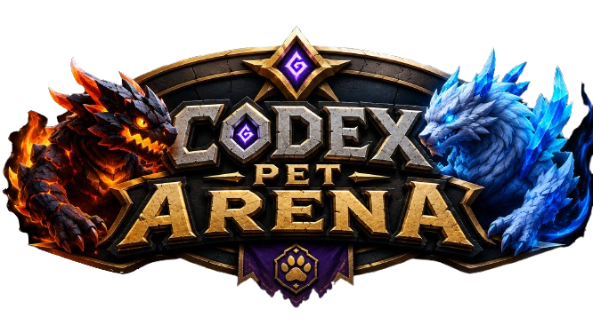

# Codex Pet Arena

[](https://nextjs.org/)
[](https://react.dev/)
[](https://www.typescriptlang.org/)
[](https://supabase.com/)



Codex Pet Arena is a multiplayer, turn-based battle app for hatched Codex pets. Players sign up, upload a Codex pet, get two personalized fight moves generated from the pet's name and description, then battle through random matchmaking or friend-code lobbies.

The battle UI is inspired by classic handheld monster fights, but uses original assets, colors, mechanics, and copy.

## Features

- Email login/signup with Supabase Auth.
- Codex pet upload flow for `pet.json` and `spritesheet.webp`.
- Import helper for public pets from `https://codex-pets.net/#/pets/<slug>`.
- Codex atlas validation:
  - `1536x1872` spritesheet
  - `8` columns by `9` rows
  - `192x208` cells
  - required rows for `idle`, `running-right`, `running-left`, `waving`, `jumping`, `failed`, `waiting`, `running`, and `review`
- Server-side pet creation with Supabase Storage persistence.
- Two generated personal moves per uploaded pet using Gemini, with deterministic fallback moves when Gemini is unavailable.
- Dashboard roster with cached local state and background refresh.
- Random matchmaking.
- Friend-code lobbies.
- Realtime battle updates through Supabase Realtime with polling fallback.
- Server-authoritative turn resolution.
- XP, levels, wins/losses, match completion, and battle reconnect support.
- Demo fight at `/battle/demo` that works without Supabase.

## Battle Rules

Each pet starts at level 1 with compact early-game stats tuned for short fights. A normal match is designed to last around 6-7 meaningful actions.

On each active turn, only the trainer whose turn it is can act. The command grid has:

- Fight move 1
- Fight move 2
- Guard
- Yield

The server resolves accuracy, damage, critical hits, affinity, status effects, XP, level-ups, win/loss updates, and battle completion. Clients render the result and subscribe to battle events.

## Tech Stack

- [Next.js App Router](https://nextjs.org/) with TypeScript
- React 19
- Supabase Auth
- Supabase Postgres
- Supabase Storage
- Supabase Realtime
- Gemini API for move generation
- Vitest for battle-engine tests
- Vercel deployment target

## Getting Started

### Prerequisites

- Node.js 20+
- npm
- Supabase project
- Optional Gemini API key

### Install

```bash
npm install
cp .env.example .env.local
npm run dev
```

Open:

```text
http://localhost:3000
```

### Environment Variables

Set these in `.env.local`:

```bash
NEXT_PUBLIC_SUPABASE_URL=...
NEXT_PUBLIC_SUPABASE_ANON_KEY=...
SUPABASE_SERVICE_ROLE_KEY=...
GEMINI_API_KEY=...
GEMINI_MODEL=gemini-2.5-flash
```

`GEMINI_API_KEY` is optional. If it is missing, pet creation still works with fallback moves.

Never expose `SUPABASE_SERVICE_ROLE_KEY` or `GEMINI_API_KEY` in client-side code.

## Supabase Setup

Run the schema in Supabase SQL Editor:

```text
supabase/schema.sql
```

For existing projects created before the RLS hardening pass, also run:

```text
supabase/security-hardening.sql
```

Enable Realtime for:

```text
match_queue
lobbies
battles
battle_turns
battle_events
```

The schema creates the `pet-assets` storage bucket and RLS policies. Pet assets are public so sprites can render in battles; uploads are still scoped to the authenticated user's folder.

Full production setup is documented in [DEPLOY.md](DEPLOY.md).

## Uploading Pets

Create a pet with the Codex `hatch-pet` skill, then upload:

```text
~/.codex/pets/<pet-id>/pet.json
~/.codex/pets/<pet-id>/spritesheet.webp
```

You can also import a public Codex pet from a URL like:

```text
https://codex-pets.net/#/pets/sable
```

## Project Structure

```text
app/                  Next.js routes and API handlers
components/           Client UI and battle components
lib/battle/           Battle engine, progression, DB transforms
lib/pets/             Codex atlas constants and validation
lib/supabase/         Browser and server Supabase clients
supabase/             Database schema and hardening SQL
tests/                Battle and move generation tests
public/               Static assets and demo pet sprites
```

## Scripts

```bash
npm run dev       # local development
npm run test      # Vitest test suite
npm run build     # production build
npm run start     # run production build locally
```

## Security Notes

- Gameplay writes go through server API routes that use the Supabase service role.
- Browser RLS policies are read-focused for gameplay tables.
- The service role key is server-only.
- Pet upload routes require an authenticated bearer token.
- Lobby and matchmaking routes verify pet ownership before creating battles.
- `profiles` are publicly readable for display name, avatar, rating, wins, and losses. Do not add private user fields to `profiles`; use a private table for that.

## Deployment

Deploy to Vercel after configuring Supabase and environment variables.

Use [DEPLOY.md](DEPLOY.md) for the full checklist, including:

- Supabase Auth
- SQL schema
- Realtime publication
- Storage bucket
- Vercel env vars
- email confirmation settings
- production smoke tests

## Verification

This repo should pass:

```bash
npm run test
npm run build
npm audit --audit-level=moderate
```

## Status

The app has the core multiplayer loop implemented: auth, pet upload, move generation, dashboard roster, matchmaking, friend-code lobbies, realtime battle view, server-authoritative turns, and progression persistence.

Areas still worth improving before a public launch:

- production rate limiting
- richer match history pages
- profile editing
- private asset mode with signed URLs
- broader end-to-end tests
